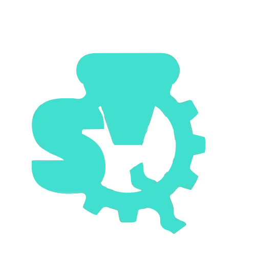
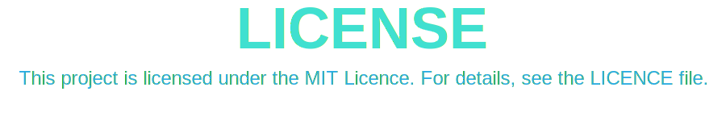
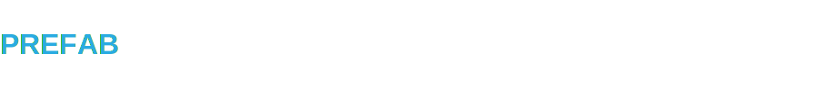
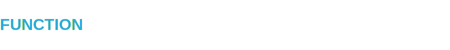
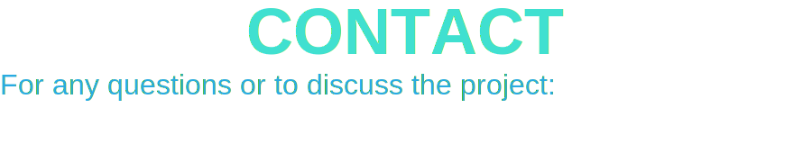

<!-- ================= LOGO SECTION ================= -->

<p align="center">
    
    
</p>


<!-- ================= CONTENT SECTION ================= -->
<p align="center">
    
</p>
<ul>
    <li><a href="#license" style="color:#29abe2;">License</a></li>
    <li><a href="#installation" style="color:#29abe2;">Installation</a>
    <ul> 
        <li><a href="#setuppackage" style="color:#29abe2;">With the Package Manager</a></li>
    </ul>
    <ul> 
        <li><a href="#setupsource" style="color:#29abe2;">Compilation from the Source</a></li>
    </ul>
    </li>
    <li><a href="#syntax" style="color:#29abe2;">Syntax</a>
      <ul> 
        <li><a href="#syntaxexample" style="color:#29abe2;">Example</a></li>
      </ul>
      <ul> 
        <li><a href="#syntaxclass" style="color:#29abe2;">Class</a></li>
      </ul>
      <ul> 
        <li><a href="#syntaxprivateclass" style="color:#29abe2;">Private Class</a></li>
      </ul>
      <ul> 
        <li><a href="#syntaxgameo" style="color:#29abe2;">GameObject</a></li>
      </ul>
      <ul> 
        <li><a href="#syntexprivategameo" style="color:#29abe2;">Private GameObject</a></li>
      </ul>
      <ul> 
        <li><a href="#syntaxprefab" style="color:#29abe2;">Prefab</a></li>
      </ul>
      <ul> 
        <li><a href="#syntaxprivateprefab" style="color:#29abe2;">Private Prefab</a></li>
      </ul>
      <ul> 
        <li><a href="#syntaxcomponent" style="color:#29abe2;">Component</a></li>
      </ul>
      <ul> 
        <li><a href="#syntaxprivatecomponent" style="color:#29abe2;">Private Component</a></li>
      </ul>
      <ul> 
        <li><a href="#syntexfunction" style="color:#29abe2;">Function</a></li>
      </ul>
      <ul> 
        <li><a href="#syntexprivatefunction" style="color:#29abe2;">Private Function</a></li>
      </ul>
      <ul> 
        <li><a href="#syntaxvariables" style="color:#29abe2;">Variables</a></li>
      </ul>
      <ul> 
        <li><a href="#syntaxgamevariables" style="color:#29abe2;">GameObject Variables</a></li>
      </ul>
    </li>
    <li><a href="#usage" style="color:#29abe2;">Usage</a></li>
    <li><a href="#contact" style="color:#29abe2;">Contact</a></li>
</ul>
<br><br>


<!-- ================= LICENSE SECTION ================= -->
<p align="center">
    
</p>


<!-- ================= INSTALLATION SECTION ================= -->
<p align="center" id="installation">
    
</p>
<h3 align="center" style="color:#29abe2;">
  To be added later
</h3>
<br>

<!-- ================= INSTALLATION Package SECTION ================= -->
<p id="setuppackage">
    
</p>
<h3 style="color:#29abe2;">
  To be added later
</h3>
<br>

<!-- ================= INSTALLATION Source SECTION ================= -->
<p id="setupsource">
    
</p>
<h3 style="color:#29abe2;">
  To be added later
</h3>
<br><br>


<!-- ================= USAGE SECTION ================= -->
<p align="center" id="installation">
    
</p>
<h3 align="center" style="color:#29abe2;">
  To be added later
</h3>
<br><br>


<!-- ================= SYNTEX SECTION ================= -->
<p align="center" id="syntax">
    
</p>
<h3 align="center" style="color:#29abe2;">
  To be added later
</h3>
<br>

<!-- ================= SYNTEX Example SECTION ================= -->
<p align="center" id="syntaxexample">
    
</p>
<br>

```tqs
Use "../others";
Use math;

# comment line

###
comment lines
comment lines
###

Class ClassExample:
    example_str:string="";
    example_int:int=0;
    example_double:double=0.0;
    example_list:list(4)=[];
    example_map:map={};
    private example_private:string="";
    public example_public:string="";

    private function function_example(**args):
        # code blocks
    end

    function function_example(**args):
        if condition:
            # code blocks
        end
        elif condition:
            # code blocks
        end
        elif (condition & condition):
            # code blocks
        end
        else:
            # code blocks
        end

        while condition:
            # code blocks
        end

        for item in list:
            # code blocks
        end
    end

    try:
        # code blocks
    catch error:
        # code blocks
    end

end

private class PrivateClassExample:
    # code blocks
end

GameObject GameObjectExample:
    example_character:Character;
    example_light:Light;
     example_camera:Camera;
     example_barrier:Barrier;
     example_3dmodel:3DMeshModel;
     example_2dmodel:2DMeshModel;
     example_material:Material;
     example_shader:Shader;
     example_animation:Animation;
     example_inputsystem:InputSystem;
     example_actionmap:ActionMap;

    start start_example(**args):
        # code blocks
    end

    update update_example(**args):
        # code blocks
    end

    awake awake_example(**args):
        # code blocks
    end
end

Prefab PrefabExample Inheritance GameObjectExample:
    # code blocks
end

Component ComponentExample:
    example_int:int=100;
    example_int_2=100;

    function example_function(**args):
        # code blocks
    end

    start start_example(**args):
        # code blocks
    end

    update update_example(**args):
        # code blocks
    end
end


```
<br>

<!-- ================= SYNTEX Class SECTION ================= -->
<p id="syntaxclass">
    
</p>
<br>

```tqs
  Class ClassExample:
    # code blocks
  end
```
<br>

<!-- ================= SYNTEX Private Class SECTION ================= -->
<p id="syntaxprivateclass">
    
</p>
<br>

```tqs
  private Class ClassExample:
    # code blocks
  end
```
<br>

<!-- ================= SYNTEX GameObject SECTION ================= -->
<p id="syntaxgameo">
    
</p>
<br>

```tqs
  GameObject GameObjectExample:
    # code blocks

    # use Special Functions Public or Private
    start start_example(**args):
        # Kod bloğu
    end

    update update_example(**args):
        # Kod bloğu
    end

    awake awake_example(**args):
        # Kod bloğu
    end
  end
```
<br>

<!-- ================= SYNTEX Private GameObject SECTION ================= -->
<p id="syntaxprivategameo">
    
</p>
<br>

```tqs
  private GameObject GameObjectExample:
    # code blocks

    # use Special Functions Public or Private
    private start start_example(**args):
        # Kod bloğu
    end

    private update update_example(**args):
        # Kod bloğu
    end

    private awake awake_example(**args):
        # Kod bloğu
    end
  end
```
<br>

<!-- ================= SYNTEX Prefab SECTION ================= -->
<p id="syntaxprefab">
    
</p>
<br>

```tqs
  Prefab PrefabExample Inheritance GameObjectExample:
    # Kod bloğu
  end
```
<br>

<!-- ================= SYNTEX Private Prefab SECTION ================= -->
<p id="syntaxprivateprefab">
    
</p>
<br>

```tqs
  private Prefab PrefabExample Inheritance GameObjectExample:
    # Kod bloğu
  end
```
<br>

<!-- ================= SYNTEX Component SECTION ================= -->
<p id="syntaxcomponent">
    
</p>
<br>

```tqs
  Component ComponentExample:
    example_int:int=100;
    example_int_2=100;

    function example_function(**args):
        # Kod bloğu
    end

    # use Special Functions Public or Private but except for Awake
    start start_example(**args):
        # Kod bloğu
    end

    update update_example(**args):
        # Kod bloğu
    end
  end
```
<br>

<!-- ================= SYNTEX Private Component SECTION ================= -->
<p id="syntaxprivatecomponent">
    
</p>
<br>

```tqs
  private Component ComponentExample:
    example_int:int=100;
    example_int_2=100;

    private function example_function(**args):
        # Kod bloğu
    end

    # use Special Functions Public or Private but except for Awake
    private start start_example(**args):
        # Kod bloğu
    end

    private update update_example(**args):
        # Kod bloğu
    end
  end
```
<br>

<!-- ================= SYNTEX Function SECTION ================= -->
<p id="syntaxfunction">
    
</p>
<br>

```tqs
  function example_function(**args):
    # Kod bloğu
  end
```
<br>

<!-- ================= SYNTEX Private Function SECTION ================= -->
<p id="syntaxprivatefunction">
    
</p>
<br>

```tqs
  private function example_function(**args):
    # Kod bloğu
  end
```
<br>

<!-- ================= SYNTEX Variables SECTION ================= -->
<p id="syntaxvariables">
    
</p>
<br>

```tqs
  # String example
  example_str:string="";

  # İnteger example
  example_int:int=0;

  # Double example
  example_double:double=0.0;

  # List example
  example_list:list(4)=[];

  # Map example
  example_map:map={};

  # Private example
  private example_private:string="";

  # Public example
  public example_public:string="";
```
<br>

<!-- ================= SYNTEX Special Variables SECTION ================= -->
<p id="syntaxgamevariables">
    
</p>
<br>

```tqs
  # Character example
  example_character:character;

  # Light example
  example_light:light;

  # Camera example
  example_camera:camera;

  # Barrier example
  example_barrier:barrier;

  # 3DMeshModel example
  example_3dmodel:3Dmeshmodel;

  # 2DMeshModel example
  example_2dmodel:2Dmeshmodel;

  # Material example
  example_material:material;

  # Shader example
  example_shader:shader;

  # Animation example
  example_animation:animation;

  # InputSystem example
  example_inputsystem:inputsystem;

  # ActionMap example
  example_actionmap:actionmap;
```
<br>
<br><br>

<!-- ================= CONTACT SECTION ================= -->
<p id="contact">
    
</p>

  <p align="center">
  
  <a href="https://github.com/KULLANICIADI">
    
  </a>
  <a href="https://www.linkedin.com/in/KULLANICIADI/">
    
  </a>
  <a href="sinanuygunwork@gmail.com">
    
  </a>
  </p>
<br><br>
